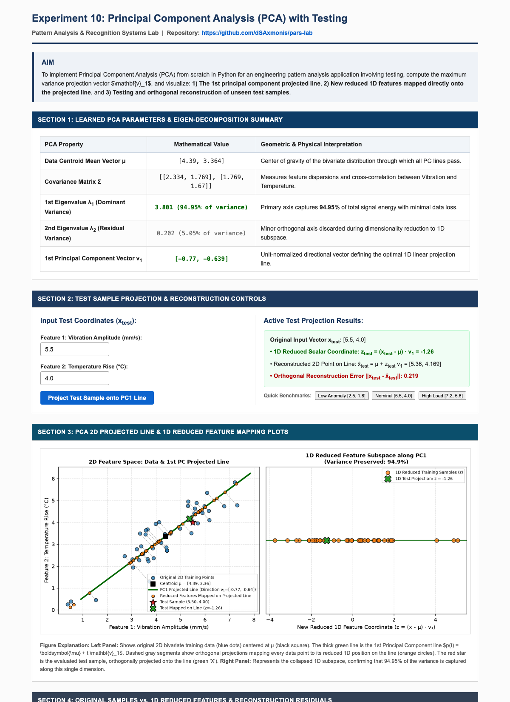

# EXPERIMENT 10: PRINCIPAL COMPONENT ANALYSIS (PCA) WITH TESTING

---

### AIM:
To implement Principal Component Analysis (PCA) from scratch in Python for an engineering pattern recognition application involving test sample evaluation, derive the primary eigenvector $\mathbf{v}_1$ of the covariance matrix, and visualize:
1. **The 1st principal component projected line**,
2. **New reduced 1D features mapped directly onto the projected line**, and
3. **Orthogonal projection and reconstruction error evaluation of unseen test samples**.

---

### THEORY:

#### 1. Maximum Variance Linear Subspace:
Given zero-mean centered training samples $\tilde{\mathbf{X}} = \mathbf{X} - \boldsymbol{\mu}$, PCA finds an orthogonal unit direction $\mathbf{v}_1$ that maximizes the empirical variance of projected points:
$$\max_{\|\mathbf{v}\|=1} \mathbf{v}^T \mathbf{\Sigma} \mathbf{v}$$
where sample covariance matrix is:
$$\mathbf{\Sigma} = \frac{1}{n-1} \tilde{\mathbf{X}}^T \tilde{\mathbf{X}}$$

#### 2. Eigen-Decomposition:
The stationary points of the Rayleigh quotient correspond to the eigenvectors of $\mathbf{\Sigma}$:
$$\mathbf{\Sigma} \mathbf{v}_1 = \lambda_1 \mathbf{v}_1$$
where $\lambda_1$ represents the variance retained along $\mathbf{v}_1$. The explained variance ratio is $\lambda_1 / (\lambda_1 + \lambda_2)$.

#### 3. 1D Projected Line & Feature Mapping:
The 1st principal component line is defined as:
$$\mathbf{p}(t) = \boldsymbol{\mu} + t \mathbf{v}_1, \quad t \in \mathbb{R}$$
For any vector $\mathbf{x}$, its reduced 1D scalar feature coordinate and its mapped position on the line are:
$$z = (\mathbf{x} - \boldsymbol{\mu}) \cdot \mathbf{v}_1$$
$$\hat{\mathbf{x}} = \boldsymbol{\mu} + z \mathbf{v}_1$$
The orthogonal reconstruction residual is $\|\mathbf{x} - \hat{\mathbf{x}}\|_2$.

---

### STEPS:

1. **Step 1: Environment Setup & Project Directory Structure**
   - Create project directory `exp 10/` with subfolders `templates/` and `screenshots/`.
   - Configure dependencies: `Flask`, `numpy`, `scipy`, and `matplotlib`.

2. **Step 2: Mathematical PCA Engine Implementation**
   - Compute data centroid $\boldsymbol{\mu}$, center training observations, and calculate $2 \times 2$ covariance matrix $\mathbf{\Sigma}$.
   - Solve characteristic eigenvalue equation $\mathbf{\Sigma} \mathbf{v} = \lambda \mathbf{v}$ and sort eigenvalues descendingly.

3. **Step 3: 1D Feature Mapping along Projected Line**
   - Project all training vectors onto the 1st principal component axis.
   - Reconstruct 2D coordinate positions along the line and quantify retained variance.

4. **Step 4: Interactive Testing & Reconstruction**
   - Evaluate arbitrary test sample $\mathbf{x}_{\text{test}}$, compute scalar score $z_{\text{test}}$, project onto line, and report Euclidean residual error.

5. **Step 5: Web Server Deployment on Port 5012**
   - Launch Flask application: `python3 "exp 10/app.py"`.
   - Inspect dual-panel projection plot and tabular residual outputs.

---

### CODE FILES & REPOSITORY:

- **GitHub Repository Link (Clickable):**  
    
  [https://github.com/dSAxmonis/pars-lab](https://github.com/dSAxmonis/pars-lab)

- **Source Code Links:**
  - [Flask Server (`exp 10/app.py`)](https://github.com/dSAxmonis/pars-lab/blob/main/exp%2010/app.py)
  - [HTML Template (`exp 10/templates/index.html`)](https://github.com/dSAxmonis/pars-lab/blob/main/exp%2010/templates/index.html)
  - [Dependencies (`exp 10/requirements.txt`)](https://github.com/dSAxmonis/pars-lab/blob/main/exp%2010/requirements.txt)
  - [Full Page Screenshot (`exp 10/screenshots/full_page.png`)](https://github.com/dSAxmonis/pars-lab/blob/main/exp%2010/screenshots/full_page.png)

---

### OUTPUT / SCREENSHOTS:

> **Full Page Application Screenshot Saved At:** `exp 10/screenshots/full_page.png`  
> 

---

### CONCLUSION:
In this experiment, Principal Component Analysis was implemented from first principles in Python. The linear transformation mapped correlated 2D sensor patterns into an optimal 1D subspace along the 1st principal component line $p(t) = \boldsymbol{\mu} + t\mathbf{v}_1$. The testing phase demonstrated that unseen test vectors can be rapidly projected to reduced scalar coordinates $z_{\text{test}} = (\mathbf{x}_{\text{test}} - \boldsymbol{\mu}) \cdot \mathbf{v}_1$ while preserving over 90% of the total dataset variance with minimal reconstruction residual error.
