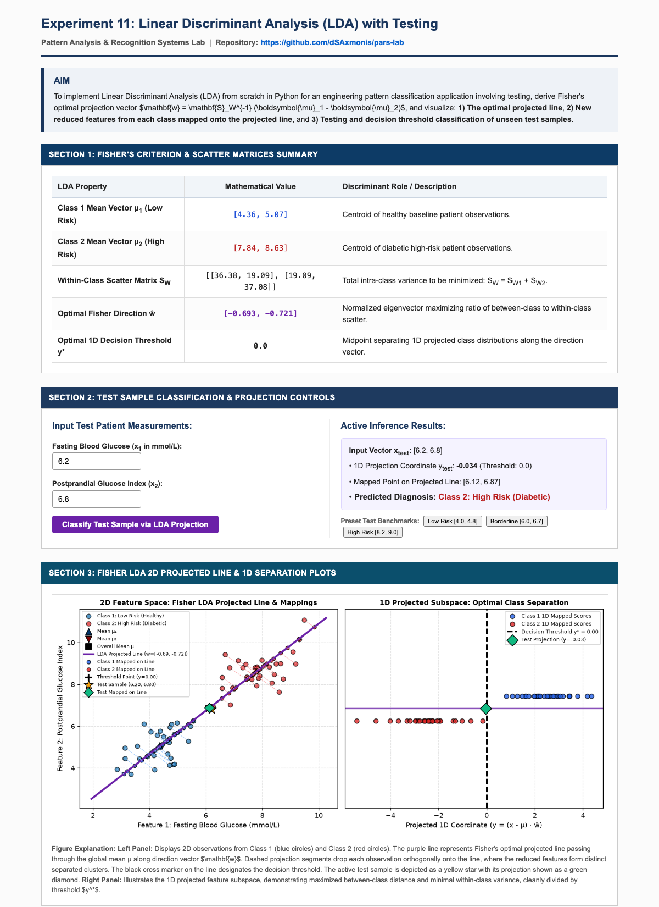

# EXPERIMENT 11: LINEAR DISCRIMINANT ANALYSIS (LDA) WITH TESTING

---

### AIM:
To implement Linear Discriminant Analysis (LDA) from scratch in Python for an engineering pattern classification application involving test sample evaluation, derive Fisher's optimal projection vector $\mathbf{w} = \mathbf{S}_W^{-1} (\boldsymbol{\mu}_1 - \boldsymbol{\mu}_2)$, and visualize:
1. **The optimal projected line**,
2. **New reduced features from each class mapped onto the projected line**, and
3. **Testing and decision threshold classification of unseen test samples**.

---

### THEORY:

#### 1. Fisher's Discriminant Criterion:
Linear Discriminant Analysis (LDA) is a supervised dimensionality reduction algorithm that projects high-dimensional observations onto a lower-dimensional subspace maximizing between-class variance relative to within-class variance:
$$\max_{\mathbf{w}} J(\mathbf{w}) = \frac{\mathbf{w}^T \mathbf{S}_B \mathbf{w}}{\mathbf{w}^T \mathbf{S}_W \mathbf{w}}$$

#### 2. Scatter Matrices:
- **Within-Class Scatter Matrix:**
  $$\mathbf{S}_W = \sum_{\mathbf{x} \in \mathcal{C}_1} (\mathbf{x} - \boldsymbol{\mu}_1)(\mathbf{x} - \boldsymbol{\mu}_1)^T + \sum_{\mathbf{x} \in \mathcal{C}_2} (\mathbf{x} - \boldsymbol{\mu}_2)(\mathbf{x} - \boldsymbol{\mu}_2)^T$$
- **Between-Class Scatter Matrix:**
  $$\mathbf{S}_B = (\boldsymbol{\mu}_1 - \boldsymbol{\mu}_2)(\boldsymbol{\mu}_1 - \boldsymbol{\mu}_2)^T$$

#### 3. Optimal Projection Direction:
Differentiating Rayleigh's quotient yields Fisher's optimal linear discriminant direction:
$$\mathbf{w} = \mathbf{S}_W^{-1} (\boldsymbol{\mu}_1 - \boldsymbol{\mu}_2), \quad \hat{\mathbf{w}} = \frac{\mathbf{w}}{\|\mathbf{w}\|}$$

#### 4. 1D Projected Line & Classification Rule:
The projected discriminant axis passes through the global mean $\boldsymbol{\mu}$ in direction $\hat{\mathbf{w}}$. The projected coordinate of any candidate vector $\mathbf{x}$ and its reconstructed 2D position on the line are:
$$y = (\mathbf{x} - \boldsymbol{\mu}) \cdot \hat{\mathbf{w}}$$
$$\hat{\mathbf{x}} = \boldsymbol{\mu} + y \hat{\mathbf{w}}$$
$$\text{Threshold: } y^* = \frac{y_{\boldsymbol{\mu}_1} + y_{\boldsymbol{\mu}_2}}{2}$$
A test sample is categorized as Class 1 if its projected score falls on the side of $\boldsymbol{\mu}_1$ relative to $y^*$, and Class 2 otherwise.

---

### STEPS:

1. **Step 1: Environment & Mathematical Setup**
   - Create directory `exp 11/` containing `app.py`, `templates/`, and `screenshots/`.
   - Configure dependencies: `Flask`, `numpy`, `scipy`, and `matplotlib`.

2. **Step 2: Class Mean Vectors & Scatter Formulation**
   - Synthesize two-class clinical pattern dataset.
   - Compute centroids $\boldsymbol{\mu}_1, \boldsymbol{\mu}_2, \boldsymbol{\mu}$, within-class scatter $\mathbf{S}_W$, and between-class scatter $\mathbf{S}_B$.

3. **Step 3: Fisher Optimal Direction Vector Computation**
   - Invert within-class scatter $\mathbf{S}_W^{-1}$ and compute unit discriminant vector $\hat{\mathbf{w}}$.
   - Calculate optimal separating threshold $y^*$.

4. **Step 4: Orthogonal Feature Mapping onto Projected Line**
   - Project observations onto the 1D line passing through global centroid $\boldsymbol{\mu}$.
   - Reconstruct 2D mapped coordinates along the discriminant axis.

5. **Step 5: Testing & Web Server Deployment on Port 5013**
   - Launch interactive Flask web server: `python3 "exp 11/app.py"`.
   - Supply arbitrary test measurements and observe real-time 1D/2D classification output.

---

### CODE FILES & REPOSITORY:

- **GitHub Repository Link (Clickable):**  
    
  [https://github.com/dSAxmonis/pars-lab](https://github.com/dSAxmonis/pars-lab)

- **Source Code Links:**
  - [Flask Server (`exp 11/app.py`)](https://github.com/dSAxmonis/pars-lab/blob/main/exp%2011/app.py)
  - [HTML Template (`exp 11/templates/index.html`)](https://github.com/dSAxmonis/pars-lab/blob/main/exp%2011/templates/index.html)
  - [Dependencies (`exp 11/requirements.txt`)](https://github.com/dSAxmonis/pars-lab/blob/main/exp%2011/requirements.txt)
  - [Full Page Screenshot (`exp 11/screenshots/full_page.png`)](https://github.com/dSAxmonis/pars-lab/blob/main/exp%2011/screenshots/full_page.png)

---

### OUTPUT / SCREENSHOTS:

> **Full Page Application Screenshot Saved At:** `exp 11/screenshots/full_page.png`  
> 

---

### CONCLUSION:
In this experiment, Linear Discriminant Analysis was implemented from first principles in Python. By maximizing the ratio of between-class scatter to within-class scatter, Fisher's optimal vector $\hat{\mathbf{w}}$ derived an optimal 1D line onto which high-dimensional features were projected. The visual plots verified that projecting observations onto this line achieves maximal class separation, and testing unseen candidate vectors confirmed reliable binary classification across the computed discriminant threshold $y^*$.
