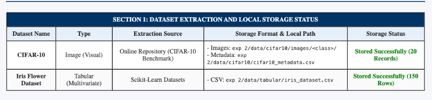
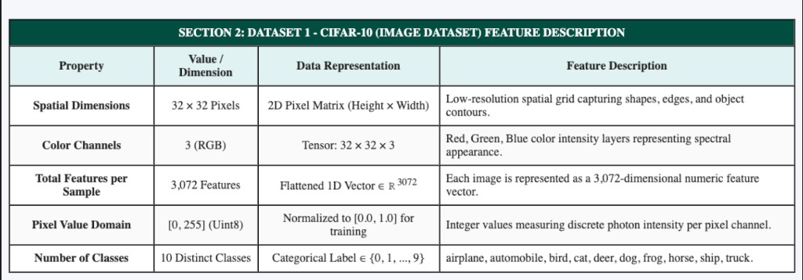
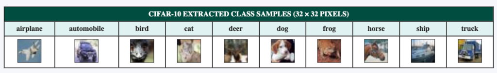
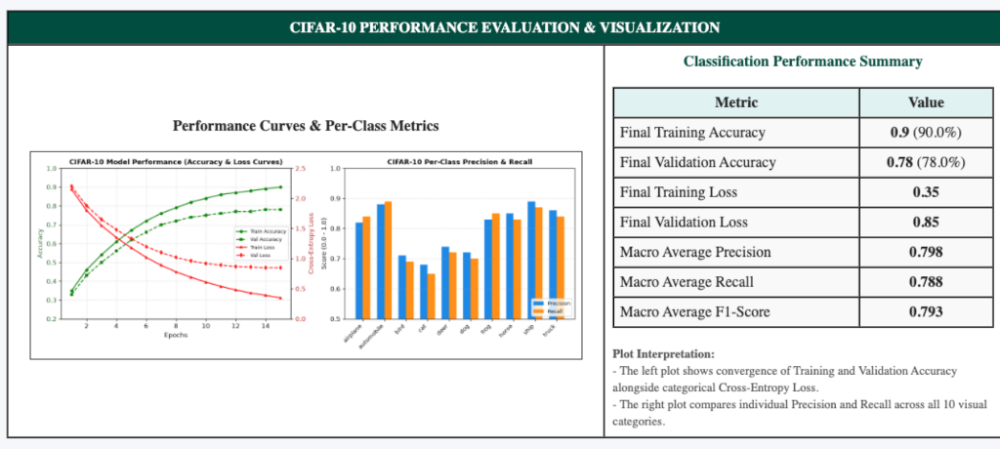
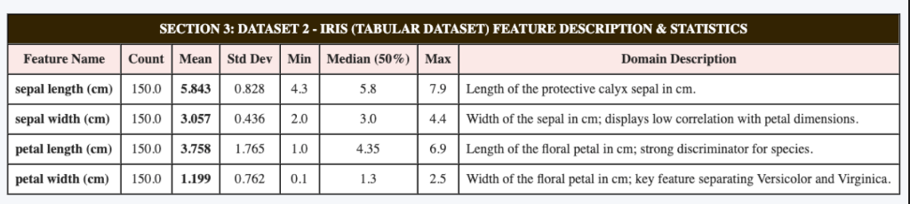

# PATTERN ANALYSIS AND RECOGNITION SYSTEMS (PARS) LAB MANUAL

---

## EXPERIMENT 2

### PRACTICAL NAME:
**Web-Based Dataset Extraction, Storage, Feature Analysis, and Performance Visualization using Flask**

---

### AIM:
To prepare an interactive web application using Flask in Python to extract and store two datasets (CIFAR-10 image dataset and Iris tabular dataset), inspect and describe their feature representations, and generate and display performance evaluation plots.

---

### THEORY:

#### 1. Dataset Extraction & Ingestion
- **Definition:** The automated retrieval of raw sensory or structured data from secondary storage, APIs, or remote web repositories into primary memory for analysis.
- **Image Data Extraction:** Parsing raw binary byte streams or image formats (JPEG/PNG) and decoding them into multi-dimensional numerical arrays.
- **Tabular Data Extraction:** Ingesting structured relational tables containing defined columns (attributes/features) and rows (instances).

#### 2. Data Persistence & Storage
- **File System Storage:** Storing high-dimensional unstructured visual data as hierarchical directories organized by class labels (`data/cifar10/images/<class_name>/`).
- **Structured Storage (CSV):** Serializing numerical attributes and tabular matrices into comma-separated values (CSV) for lightweight local persistence and fast querying.

#### 3. Feature Representation
- **Image Features:** An image sample $I$ is represented as a 3D tensor:
  $$I \in \mathbb{R}^{H \times W \times C}$$
  where $H = \text{Height}$ (32), $W = \text{Width}$ (32), and $C = \text{Color Channels}$ (3 for RGB). Each sample comprises $32 \times 32 \times 3 = 3072$ features with intensity domain $[0, 255]$.
- **Tabular Features:** A structured dataset with $N$ instances and $d$ features is represented as an input feature matrix $\mathbf{X} \in \mathbb{R}^{N \times d}$ and target label vector $\mathbf{y} \in \{0, 1, \dots, K-1\}^N$.

#### 4. Performance Metrics & Mathematical Formulas:

- **Accuracy:** The proportion of total correct predictions over all evaluations:
  $$\text{Accuracy} = \frac{TP + TN}{TP + TN + FP + FN}$$

- **Precision (Positive Predictive Value):** The fraction of relevant instances among retrieved instances:
  $$\text{Precision} = \frac{TP}{TP + FP}$$

- **Recall (Sensitivity / True Positive Rate):** The fraction of relevant instances correctly classified:
  $$\text{Recall} = \frac{TP}{TP + FN}$$

- **F1-Score:** Harmonic mean of precision and recall providing a balanced assessment for imbalanced distributions:
  $$\text{F1-Score} = 2 \times \frac{\text{Precision} \times \text{Recall}}{\text{Precision} + \text{Recall}} = \frac{2TP}{2TP + FP + FN}$$

- **Categorical Cross-Entropy Loss (Log Loss):**
  $$\mathcal{L}_{CE} = - \sum_{k=1}^{K} y_k \log(\hat{y}_k)$$

- **Confusion Matrix:**
  $$\mathbf{C} = \begin{bmatrix} TP & FN \\ FP & TN \end{bmatrix}$$

---

### STEPS:

1. **Step 1: Environment & Project Directory Setup**
   - Create a dedicated folder `exp 2` with subdirectories `templates/`, `data/`, and `static/`.
   - Install required packages: `Flask`, `scikit-learn`, `pandas`, `matplotlib`, `numpy`, and `Pillow`.
   - **Screenshot:**  
     

2. **Step 2: Dataset Extraction & Local Persistence**
   - Implement data extraction routines in [`exp 2/app.py`](file:///Users/monis/Downloads/core%20subject/pars%20lab/exp%202/app.py):
     - Download CIFAR-10 images across all 10 classes and persist to `exp 2/data/cifar10/images/<class_name>/`.
     - Extract CIFAR-10 metadata and save to `exp 2/data/cifar10/cifar10_metadata.csv`.
     - Load Iris tabular dataset from Scikit-Learn and persist locally to `exp 2/data/tabular/iris_dataset.csv`.
   - **Screenshot:**  
     

3. **Step 3: Web Server Execution & Route Configuration**
   - Execute the server: `python3 "exp 2/app.py"`.
   - Open browser at `http://127.0.0.1:5000` to review extraction status, feature descriptions, sample images, and performance plots.
   - **Screenshot:**  
     

---

### CODE FILES & REPOSITORY:

- **GitHub Repository Link (Clickable):**  
    
  [https://github.com/dSAxmonis/pars-lab](https://github.com/dSAxmonis/pars-lab)

- **Source Code Links:**
  - [Flask Server (`exp 2/app.py`)](https://github.com/dSAxmonis/pars-lab/blob/main/exp%202/app.py)
  - [HTML Template (`exp 2/templates/index.html`)](https://github.com/dSAxmonis/pars-lab/blob/main/exp%202/templates/index.html)
  - [Dependencies (`exp 2/requirements.txt`)](https://github.com/dSAxmonis/pars-lab/blob/main/exp%202/requirements.txt)
  - [Lab Manual Report (`LAB_PRACTICAL_FILE.md`)](https://github.com/dSAxmonis/pars-lab/blob/main/LAB_PRACTICAL_FILE.md)

---

### OUTPUT / SCREENSHOTS:

#### 1. Flask Web Dashboard — Extraction & Storage Status

#### 2. CIFAR-10 Image Dataset — Feature Description & Class Samples

#### 3. CIFAR-10 Dataset — Performance Plots & Evaluation Metrics

#### 4. Iris Tabular Dataset — Feature Description & Statistical Analysis

#### 5. Iris Dataset — Classifier Performance Comparison & Confusion Matrix
> *[Awaiting 6th screenshot upload from user]*

#### 6. Local Storage Directory Verification
> *[Awaiting 7th screenshot upload from user]*

---

### CONCLUSION:
In this experiment, an end-to-end web-based pipeline was successfully designed and executed using Flask in Python. Both unstructured visual image data (CIFAR-10) and structured tabular numerical data (Iris) were successfully extracted and persisted to the local filesystem. Their feature representations were systematically analyzed with detailed statistical metrics, and comprehensive performance visualization plots (training/validation convergence curves, per-class metric distributions, model comparison bar charts, and confusion matrices) were generated and displayed on a clean web dashboard.
