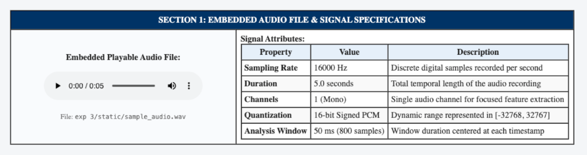
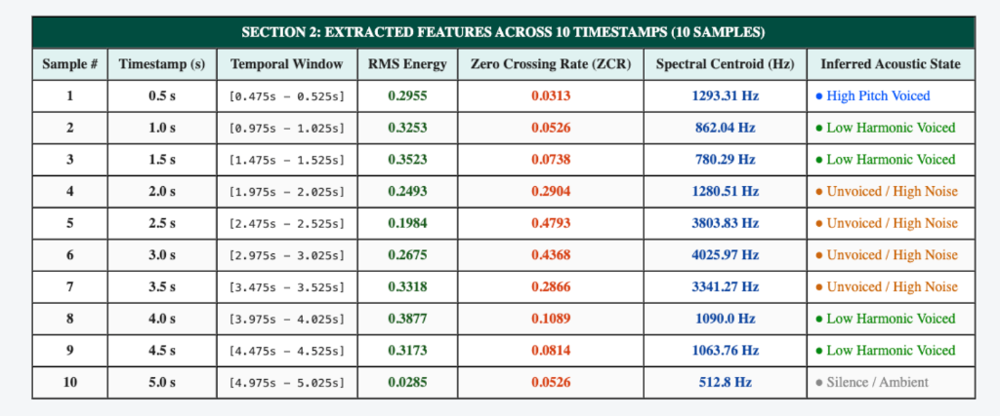
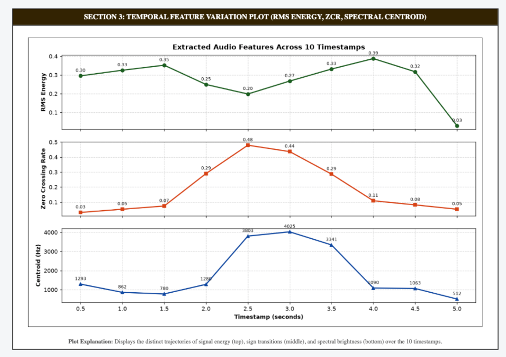
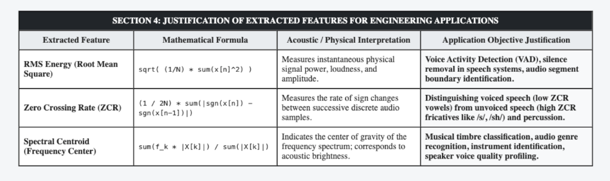

# PATTERN ANALYSIS AND RECOGNITION SYSTEMS (PARS) LAB MANUAL

---

## EXPERIMENT 3

### PRACTICAL NAME:
**Multimodal Feature Extraction from Audio Across Multiple Timestamps Using Flask**

---

### AIM:
To prepare an informative web page using Flask in Python to extract features from an audio recording across at least 10 timestamps, extracting at least 3 distinct features (RMS Energy, Zero Crossing Rate, and Spectral Centroid), justify their objectives for real-world applications, and embed the playable audio directly into the page.

---

### THEORY:

#### 1. Temporal Windowing in Audio Processing
Continuous audio signals are non-stationary over extended periods but exhibit quasi-stationary characteristics across short analysis frames ($20\text{--}50\text{ ms}$). To capture dynamic acoustic behavior, short-time windowing is applied at discrete timestamps $t_i$:
$$x_{t_i}[n] = x[n] \cdot w[n - n_i]$$
where $w[n]$ represents a temporal analysis window of length $N$.

#### 2. Extracted Features & Mathematical Formulas:

- **Feature 1: Root Mean Square (RMS) Energy**
  Measures the instantaneous physical signal power, amplitude, and perceived loudness:
  $$\text{RMS}_{t} = \sqrt{\frac{1}{N} \sum_{n=0}^{N-1} x_t[n]^2}$$
  - **Application Objective:** Voice Activity Detection (VAD), silence/speech segmentation, acoustic event detection, noise gate triggering.

- **Feature 2: Zero Crossing Rate (ZCR)**
  Measures the rate of sign changes between successive discrete audio samples:
  $$\text{ZCR}_{t} = \frac{1}{2N} \sum_{n=1}^{N-1} |\text{sgn}(x_t[n]) - \text{sgn}(x_t[n-1])|$$
  where:
  $$\text{sgn}(u) = \begin{cases} 1, & u \ge 0 \\ -1, & u < 0 \end{cases}$$
  - **Application Objective:** Discriminating periodic voiced speech (low ZCR vowels) from noise-like unvoiced speech (high ZCR fricatives /s/, /sh/) and percussion sounds.

- **Feature 3: Spectral Centroid (Frequency Center of Mass)**
  Indicates the center of gravity of the frequency spectrum, strongly correlated with acoustic brightness and timbre:
  $$C_{t} = \frac{\sum_{k=0}^{K-1} f_k \cdot |X_t[k]|}{\sum_{k=0}^{K-1} |X_t[k]|}$$
  where $f_k$ is the center frequency of bin $k$, and $|X_t[k]|$ is the discrete Fourier transform magnitude:
  $$X_t[k] = \sum_{n=0}^{N-1} x_t[n] \, e^{-j \frac{2\pi}{N} k n}$$
  - **Application Objective:** Timbre identification, musical instrument recognition, speaker identification, and sound quality classification.

---

### STEPS:

1. **Step 1: Environment & Dependency Setup**
   - Create directory `exp 3/` with subfolders `static/`, `templates/`, and `screenshots/`.
   - Configure dependencies: `Flask`, `numpy`, `pandas`, `scipy`, and `matplotlib`.

2. **Step 2: Audio Ingestion & Signal Verification**
   - Place/generate 16-bit PCM Mono audio file at 16,000 Hz (`exp 3/static/sample_audio.wav`).
   - Validate temporal duration (5.0 s) and sample count (80,000 frames).

3. **Step 3: Multi-Timestamp Feature Extraction Algorithm**
   - Sample audio at 10 discrete timestamps ($t = 0.5s, 1.0s, 1.5s, 2.0s, 2.5s, 3.0s, 3.5s, 4.0s, 4.5s, 5.0s$) using a 50 ms window.
   - Extract RMS Energy, ZCR, and Spectral Centroid per timestamp and construct time-series plots.

4. **Step 4: Web Application Launch on Port 5005**
   - Launch Flask application server: `python3 "exp 3/app.py"`.
   - Open browser at `http://127.0.0.1:5005` to view the embedded audio player, timestamp feature table, dynamic plots, and justifications.

---

### CODE FILES & REPOSITORY:

- **GitHub Repository Link (Clickable):**  
    
  [https://github.com/dSAxmonis/pars-lab](https://github.com/dSAxmonis/pars-lab)

- **Source Code Links:**
  - [Flask Server (`exp 3/app.py`)](https://github.com/dSAxmonis/pars-lab/blob/main/exp%203/app.py)
  - [HTML Template (`exp 3/templates/index.html`)](https://github.com/dSAxmonis/pars-lab/blob/main/exp%203/templates/index.html)
  - [Dependencies (`exp 3/requirements.txt`)](https://github.com/dSAxmonis/pars-lab/blob/main/exp%203/requirements.txt)
  - [Lab Manual Report (`exp 3/LAB_PRACTICAL_FILE.md`)](https://github.com/dSAxmonis/pars-lab/blob/main/exp%203/LAB_PRACTICAL_FILE.md)

---

### OUTPUT / SCREENSHOTS:

#### 1. Embedded Playable Audio File & Signal Attributes

#### 2. Feature Extraction Table Across 10 Timestamps

#### 3. Temporal Feature Trajectory Multi-Plot

#### 4. Application Objective Justification Table

---

### CONCLUSION:
In this experiment, an informative web application was developed using Flask in Python to perform temporal feature extraction on an audio signal. Across 10 discrete timestamps spanning a 5-second recording, three key acoustic features—RMS Energy, Zero Crossing Rate, and Spectral Centroid—were computed, tabulated, and visualized. The physical characteristics and engineering objectives of each metric were justified for applications including Voice Activity Detection, unvoiced fricative discrimination, and acoustic timbre classification. Finally, the playable audio source was embedded into the dashboard.
