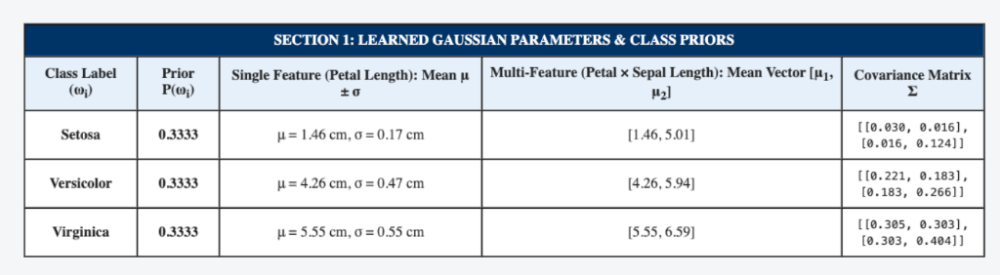
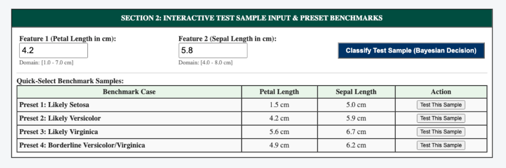
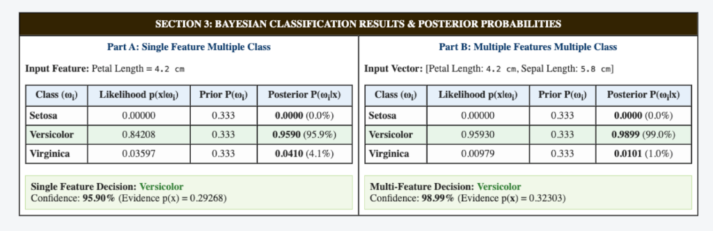
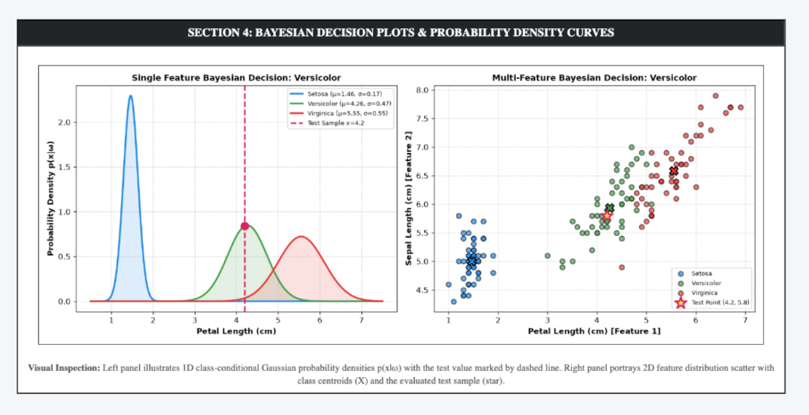

# PATTERN ANALYSIS AND RECOGNITION SYSTEMS (PARS) LAB MANUAL

---

## EXPERIMENT 4

### PRACTICAL NAME:
**Bayesian Classification for Single Feature & Multiple Features Multiple Class Using Flask**

---

### AIM:
To prepare an interactive web application using Flask in Python to implement Bayesian classification for both Single-Feature Multiple-Class and Multiple-Features Multiple-Class scenarios, compute prior, likelihood, and posterior probabilities, and classify test samples using the Maximum A Posteriori (MAP) decision rule.

---

### THEORY:

#### 1. Bayesian Decision Theory
Bayesian decision theory provides a statistical foundation for pattern recognition under uncertainty. Given an observed feature vector $\mathbf{x} \in \mathbb{R}^d$ and a discrete set of classes $\Omega = \{\omega_1, \omega_2, \dots, \omega_C\}$, Bayes' Theorem yields the posterior probability:
$$P(\omega_i|\mathbf{x}) = \frac{p(\mathbf{x}|\omega_i) P(\omega_i)}{p(\mathbf{x})} = \frac{p(\mathbf{x}|\omega_i) P(\omega_i)}{\sum_{j=1}^C p(\mathbf{x}|\omega_j) P(\omega_j)}$$
where:
- $P(\omega_i)$ is the **Prior Probability** of class $\omega_i$.
- $p(\mathbf{x}|\omega_i)$ is the **Class-Conditional Probability Density (Likelihood)**.
- $p(\mathbf{x}) = \sum_{j=1}^C p(\mathbf{x}|\omega_j) P(\omega_j)$ is the **Evidence (Marginal Probability)**.
- $P(\omega_i|\mathbf{x})$ is the **Posterior Probability** (probability that $\mathbf{x}$ belongs to $\omega_i$ given observation $\mathbf{x}$).

#### 2. Single Feature Multiple Class (Univariate Gaussian)
When considering a single scalar feature $x \in \mathbb{R}$ (e.g., Petal Length), the class-conditional density is modeled as a univariate normal distribution:
$$p(x|\omega_i) = \frac{1}{\sigma_i \sqrt{2\pi}} \exp\left(-\frac{(x - \mu_i)^2}{2\sigma_i^2}\right)$$
Parameters are estimated via Maximum Likelihood Estimation:
$$\mu_i = \frac{1}{N_i} \sum_{k=1}^{N_i} x_k, \quad \sigma_i^2 = \frac{1}{N_i - 1} \sum_{k=1}^{N_i} (x_k - \mu_i)^2$$

#### 3. Multiple Features Multiple Class (Multivariate Gaussian)
For $d$-dimensional feature vectors $\mathbf{x} = [x_1, x_2, \dots, x_d]^T \in \mathbb{R}^d$ (e.g., Petal Length & Sepal Length, $d=2$), the joint likelihood is governed by a multivariate normal density:
$$p(\mathbf{x}|\omega_i) = \frac{1}{(2\pi)^{d/2} |\mathbf{\Sigma}_i|^{1/2}} \exp\left(-\frac{1}{2}(\mathbf{x} - \boldsymbol{\mu}_i)^T \mathbf{\Sigma}_i^{-1} (\mathbf{x} - \boldsymbol{\mu}_i)\right)$$
where $\boldsymbol{\mu}_i \in \mathbb{R}^d$ is the class mean vector, and $\mathbf{\Sigma}_i \in \mathbb{R}^{d \times d}$ is the covariance matrix capturing inter-feature dependencies:
$$\mathbf{\Sigma}_i = \frac{1}{N_i - 1} \sum_{k=1}^{N_i} (\mathbf{x}_k - \boldsymbol{\mu}_i)(\mathbf{x}_k - \boldsymbol{\mu}_i)^T$$

#### 4. Bayes Decision Rule (Maximum A Posteriori - MAP)
Under zero-one loss, the optimal decision minimizes the probability of error by assigning $\mathbf{x}$ to the class with the highest posterior probability:
$$\hat{\omega} = \arg\max_{\omega_i \in \Omega} P(\omega_i|\mathbf{x}) = \arg\max_{\omega_i \in \Omega} \left[ p(\mathbf{x}|\omega_i) P(\omega_i) \right]$$

---

### STEPS:

1. **Step 1: Environment & Dependency Setup**
   - Create project directory `exp 4/` with subfolders `templates/` and `screenshots/`.
   - Install dependencies: `Flask`, `numpy`, `pandas`, `scipy`, `scikit-learn`, and `matplotlib`.

2. **Step 2: Gaussian Parameter Estimation (MLE)**
   - Partition the training dataset (Iris) into 3 classes ($\omega_1$: Setosa, $\omega_2$: Versicolor, $\omega_3$: Virginica).
   - Estimate univariate mean $\mu_i$ and variance $\sigma_i^2$ for Single Feature ($x_1$).
   - Estimate mean vectors $\boldsymbol{\mu}_i$ and covariance matrices $\mathbf{\Sigma}_i$ for Multiple Features ($x_1, x_2$).

3. **Step 3: Bayesian Classification Inference**
   - Evaluate univariate Gaussian likelihood $p(x|\omega_i)$ and multivariate Gaussian likelihood $p(\mathbf{x}|\omega_i)$.
   - Compute total evidence $p(\mathbf{x})$ and normalize to calculate exact posterior probabilities $P(\omega_i|\mathbf{x})$.

4. **Step 4: Interactive Web Application Deployment**
   - Implement interactive Flask routes on port 5006 accepting user-supplied test sample coordinates.
   - Render 1D probability density bell curves and 2D scatter decision boundaries.

---

### CODE FILES & REPOSITORY:

- **GitHub Repository Link (Clickable):**  
    
  [https://github.com/dSAxmonis/pars-lab](https://github.com/dSAxmonis/pars-lab)

- **Source Code Links:**
  - [Flask Server (`exp 4/app.py`)](https://github.com/dSAxmonis/pars-lab/blob/main/exp%204/app.py)
  - [HTML Template (`exp 4/templates/index.html`)](https://github.com/dSAxmonis/pars-lab/blob/main/exp%204/templates/index.html)
  - [Dependencies (`exp 4/requirements.txt`)](https://github.com/dSAxmonis/pars-lab/blob/main/exp%204/requirements.txt)
  - [Lab Manual Report (`exp 4/LAB_PRACTICAL_FILE.md`)](https://github.com/dSAxmonis/pars-lab/blob/main/exp%204/LAB_PRACTICAL_FILE.md)

---

### OUTPUT / SCREENSHOTS:

#### 1. Learned Gaussian Model Parameters & Class Priors

#### 2. Interactive Test Sample Input Form & Benchmark Presets

#### 3. Single-Feature and Multi-Feature Bayesian Classification Results

#### 4. Bayesian Decision Visualization Plots (1D Curves & 2D Scatter)

---

### CONCLUSION:
In this experiment, an interactive Bayesian pattern classification system was developed using Flask in Python. The implementation successfully evaluated both Single-Feature Multiple-Class (univariate Gaussian) and Multiple-Features Multiple-Class (multivariate Gaussian) architectures. Prior probabilities, class-conditional likelihoods, and posterior probabilities were computed under Bayes' rule. The Maximum A Posteriori (MAP) decision criterion was demonstrated interactively, revealing how incorporating multiple dimensions (e.g. covariance between features) sharpens class boundaries and resolves ambiguities in overlapping regions.
