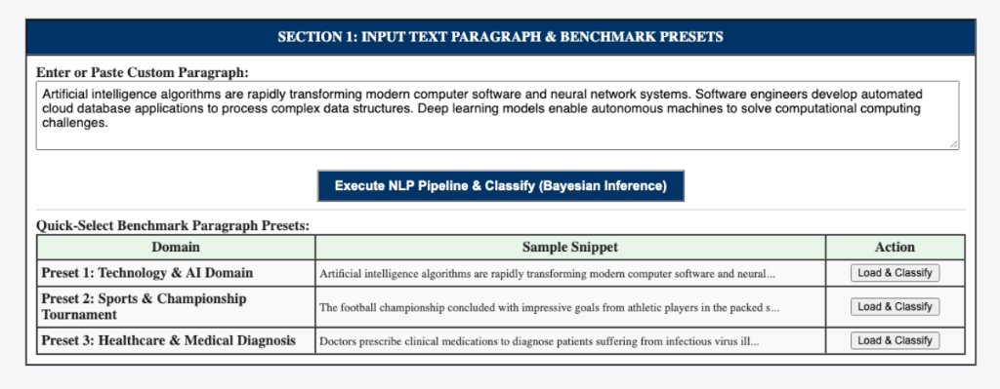
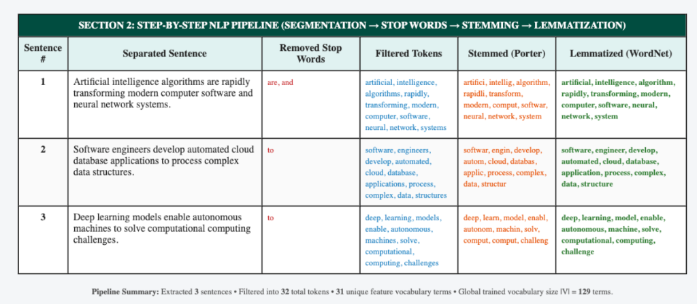
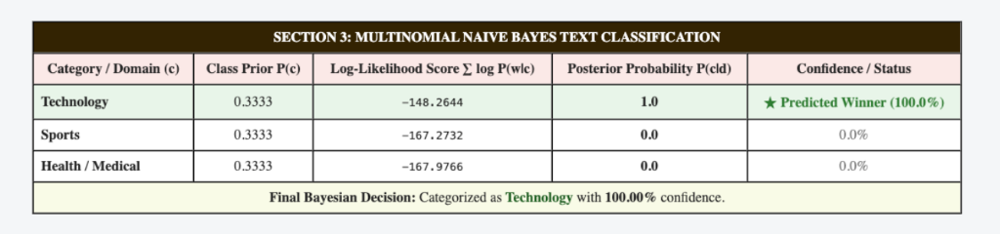
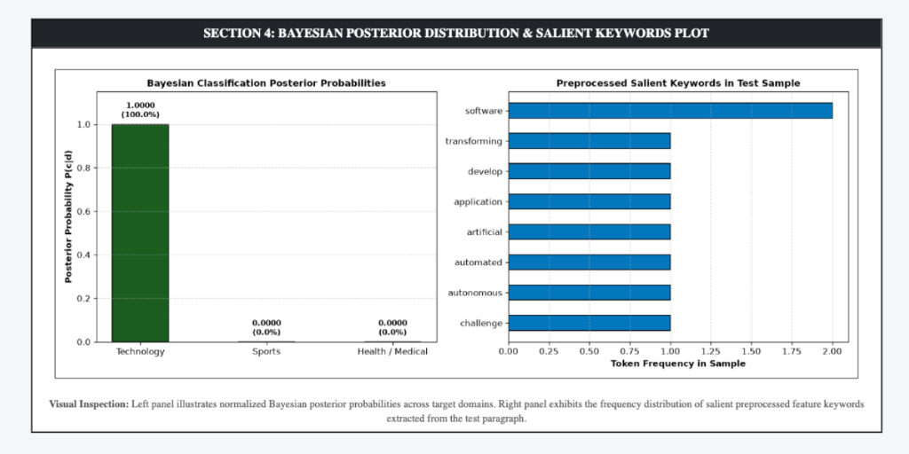

# PATTERN ANALYSIS AND RECOGNITION SYSTEMS (PARS) LAB MANUAL

---

## EXPERIMENT 5

### PRACTICAL NAME:
**Text Paragraph Segmentation, Stop Words Removal, Stemming, Lemmatization, and Bayesian Classification Using Flask**

---

### AIM:
To prepare an interactive web application using Flask in Python to extract a text paragraph, separate it into individual sentences, filter out English stop words, apply stemming and lemmatization, and classify the processed text into domain categories using a Multinomial Naive Bayes classifier.

---

### THEORY:

#### 1. Sentence Segmentation & Tokenization
- **Sentence Tokenization:** Splitting continuous prose into distinct grammatical sentences $S = \{s_1, s_2, \dots, s_m\}$ utilizing unsupervised boundary detection models (e.g., Punkt tokenizer).
- **Word Tokenization:** Decomposing each sentence into discrete lexical tokens $T = \{w_1, w_2, \dots, w_k\}$ while eliminating punctuation and non-alphabetic noise.

#### 2. Stop Words Filtering
Stop words comprise high-frequency syntactic function words (e.g., *the, is, at, which, on, for, with*) that carry negligible topical discrimination. Filtering produces a concise semantic vocabulary:
$$T_{\text{filtered}} = \{w \in T \mid w \notin W_{\text{stop}}\}$$

#### 3. Morphological Normalization: Stemming vs. Lemmatization
- **Stemming (Porter Stemmer):** A heuristic rule-based affix-stripping technique that truncates words to common root stems (e.g., *transforming* $\to$ *transform*, *computing* $\to$ *comput*).
- **Lemmatization (WordNet Lemmatizer):** A lexicographical approach utilizing vocabulary morphological analysis to transform words to canonical dictionary headwords (lemmas) (e.g., *better* $\to$ *good*, *corpora* $\to$ *corpus*, *algorithms* $\to$ *algorithm*).

#### 4. Multinomial Naive Bayes Text Classification
Representing a document as a bag-of-words vector $\mathbf{d} = (w_1, w_2, \dots, w_k)$, the conditional probability under feature independence assumption is formulated via Bayes' Theorem:
$$P(c|\mathbf{d}) = \frac{P(c) \prod_{j=1}^k P(w_j|c)}{P(\mathbf{d})}$$

- **Class Prior Probability:**
  $$P(c) = \frac{N_c}{N}$$

- **Laplace (Add-1) Smoothed Word Likelihood:**
  $$P(w_j|c) = \frac{\text{count}(w_j, c) + 1}{\sum_{w \in V} \text{count}(w, c) + |V|}$$
  where $|V|$ denotes the total vocabulary size, preventing zero-probability penalties for unseen test tokens.

- **Maximum A Posteriori (MAP) Decision Rule (Log Space):**
  $$\hat{c} = \arg\max_{c \in C} \left[ \ln P(c) + \sum_{j=1}^k \ln P(w_j|c) \right]$$

- **Normalized Posterior Probability (Softmax):**
  $$P(c|\mathbf{d}) = \frac{\exp\left(\ln P(c|\mathbf{d})\right)}{\sum_{c' \in C} \exp\left(\ln P(c'|\mathbf{d})\right)}$$

---

### STEPS:

1. **Step 1: Environment Setup & NLP Corpora Verification**
   - Create directory `exp 5/` containing `app.py`, `templates/`, and `screenshots/`.
   - Install dependencies: `Flask`, `nltk`, `numpy`, and `matplotlib`.
   - Verify NLTK resource packages: `punkt`, `punkt_tab`, `stopwords`, and `wordnet`.

2. **Step 2: Sentence Segmentation & Lexical Tokenization**
   - Ingest input multi-sentence paragraph and apply `sent_tokenize()`.
   - Break each segmented sentence into alphabetical tokens using `word_tokenize()`.

3. **Step 3: Stop Words Removal, Stemming, and Lemmatization**
   - Filter tokens against standard English stop words dictionary (179 words).
   - Apply `PorterStemmer` to extract morphological stems.
   - Apply `WordNetLemmatizer` to derive base dictionary lemmas.

4. **Step 4: Bayesian Classification Execution & Web Deployment**
   - Train Multinomial Naive Bayes model on domain corpus (Technology, Sports, Health).
   - Launch interactive Flask web server on port 5007 to classify custom paragraphs and plot posterior distributions.

---

### CODE FILES & REPOSITORY:

- **GitHub Repository Link (Clickable):**  
    
  [https://github.com/dSAxmonis/pars-lab](https://github.com/dSAxmonis/pars-lab)

- **Source Code Links:**
  - [Flask Server (`exp 5/app.py`)](https://github.com/dSAxmonis/pars-lab/blob/main/exp%205/app.py)
  - [HTML Template (`exp 5/templates/index.html`)](https://github.com/dSAxmonis/pars-lab/blob/main/exp%205/templates/index.html)
  - [Dependencies (`exp 5/requirements.txt`)](https://github.com/dSAxmonis/pars-lab/blob/main/exp%205/requirements.txt)
  - [Lab Manual Report (`exp 5/LAB_PRACTICAL_FILE.md`)](https://github.com/dSAxmonis/pars-lab/blob/main/exp%205/LAB_PRACTICAL_FILE.md)

---

### OUTPUT / SCREENSHOTS:

#### 1. Input Paragraph & Benchmark Presets

#### 2. Sentence-by-Sentence NLP Preprocessing Pipeline Table

#### 3. Multinomial Naive Bayes Classification Results Table

#### 4. Bayesian Posterior Distribution & Salient Keywords Plot

---

### CONCLUSION:
In this experiment, an end-to-end natural language processing and text categorization pipeline was successfully implemented using Flask and NLTK in Python. The workflow demonstrated sentence boundary segmentation, token cleaning, stop words removal, Porter stemming, and WordNet lemmatization. Finally, a Multinomial Naive Bayes classifier with Laplace smoothing accurately predicted the topical domain of test paragraphs based on word likelihoods and prior probabilities, displaying the entire transformation and probability distribution on an interactive web page.
