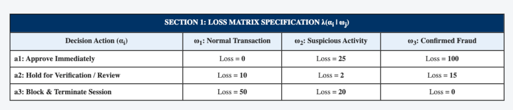
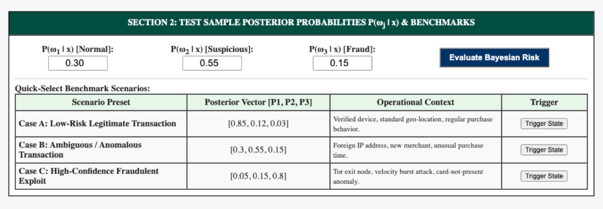
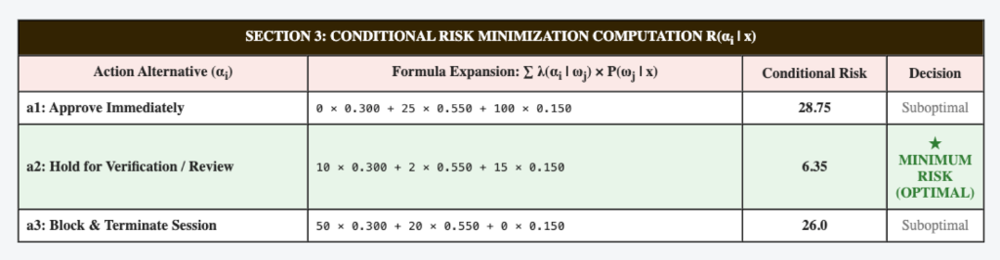
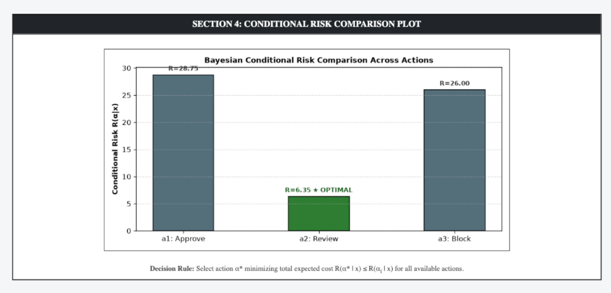

# PATTERN ANALYSIS AND RECOGNITION SYSTEMS (PARS) LAB MANUAL

---

## EXPERIMENT 6

### PRACTICAL NAME:
**Bayesian Risk Minimization for Three Classes and Three Actions Using Flask**

---

### AIM:
To prepare an interactive web application using Flask in Python to implement Bayesian Risk Minimization for at least three classes and three actions, evaluate the conditional risk given an arbitrary loss matrix, and trigger and dynamically reflect optimal action consequences on the page.

---

### THEORY:

#### 1. Bayesian Decision Theory & Risk Formulation
While Maximum A Posteriori (MAP) classification minimizes the raw probability of error under a uniform 0-1 loss, real-world systems incur asymmetric costs for different error types (e.g., approving a fraudulent transaction vs. delaying a normal purchase). Bayesian Risk Minimization formalizes this trade-off by incorporating a formal **Loss Matrix** $\Lambda = [\lambda(\alpha_i | \omega_j)]$.

Let:
- $\Omega = \{\omega_1, \omega_2, \omega_3\}$ represent the discrete states of nature (e.g., Normal, Suspicious, Fraudulent).
- $\mathcal{A} = \{\alpha_1, \alpha_2, \alpha_3\}$ represent the available decision actions (e.g., Approve, Review, Block).
- $\lambda(\alpha_i | \omega_j)$ denote the quantifiable loss incurred by choosing action $\alpha_i$ when the true state of nature is $\omega_j$.

#### 2. Conditional Risk (Expected Loss)
Given an observed feature vector $\mathbf{x}$, the conditional risk $R(\alpha_i | \mathbf{x})$ of taking action $\alpha_i$ is computed as the expectation over all classes:
$$R(\alpha_i | \mathbf{x}) = \sum_{j=1}^{C} \lambda(\alpha_i | \omega_j) P(\omega_j | \mathbf{x})$$

#### 3. Optimal Bayes Decision Rule
The optimal Bayesian decision $\alpha^*$ minimizes the conditional risk:
$$\alpha^* = \arg\min_{\alpha_i \in \mathcal{A}} R(\alpha_i | \mathbf{x})$$

#### 4. Loss Matrix Specification:
$$\mathbf{\Lambda} = \begin{bmatrix}
\lambda(\alpha_1 | \omega_1) & \lambda(\alpha_1 | \omega_2) & \lambda(\alpha_1 | \omega_3) \\
\lambda(\alpha_2 | \omega_1) & \lambda(\alpha_2 | \omega_2) & \lambda(\alpha_2 | \omega_3) \\
\lambda(\alpha_3 | \omega_1) & \lambda(\alpha_3 | \omega_2) & \lambda(\alpha_3 | \omega_3)
\end{bmatrix} = \begin{bmatrix}
0 & 25 & 100 \\
10 & 2 & 15 \\
50 & 20 & 0
\end{bmatrix}$$

---

### STEPS:

1. **Step 1: Environment & Dependency Setup**
   - Create directory `exp 6/` with subfolders `templates/` and `screenshots/`.
   - Install required packages: `Flask`, `numpy`, and `matplotlib`.

2. **Step 2: Define Loss Matrix & Actions Engine**
   - Define states of nature: $\omega_1$ (Normal), $\omega_2$ (Suspicious), $\omega_3$ (Fraudulent).
   - Configure action alternatives: $\alpha_1$ (Approve), $\alpha_2$ (Review), $\alpha_3$ (Block) with corresponding asymmetric penalty costs.

3. **Step 3: Implement Conditional Risk Calculation Logic**
   - Implement dot product matrix multiplication $R = \mathbf{\Lambda} \cdot \mathbf{P}$.
   - Identify index of minimum risk: $\alpha^* = \arg\min_i R_i$.

4. **Step 4: Launch Web Server & Validate Dynamic Action Reflection**
   - Run the Flask server: `python3 "exp 6/app.py"` on port 5008.
   - Test benchmark presets and observe dynamic colored status banner and action event logs reflected directly on the page.

---

### CODE FILES & REPOSITORY:

- **GitHub Repository Link (Clickable):**  
    
  [https://github.com/dSAxmonis/pars-lab](https://github.com/dSAxmonis/pars-lab)

- **Source Code Links:**
  - [Flask Server (`exp 6/app.py`)](https://github.com/dSAxmonis/pars-lab/blob/main/exp%206/app.py)
  - [HTML Template (`exp 6/templates/index.html`)](https://github.com/dSAxmonis/pars-lab/blob/main/exp%206/templates/index.html)
  - [Dependencies (`exp 6/requirements.txt`)](https://github.com/dSAxmonis/pars-lab/blob/main/exp%206/requirements.txt)
  - [Lab Manual Report (`exp 6/LAB_PRACTICAL_FILE.md`)](https://github.com/dSAxmonis/pars-lab/blob/main/exp%206/LAB_PRACTICAL_FILE.md)

---

### OUTPUT / SCREENSHOTS:

#### 1. Loss Matrix Specification Table

#### 2. Test Sample Posterior Probabilities & Benchmark Scenarios

#### 3. Conditional Risk Minimization Computation Table

#### 4. Conditional Risk Comparison Bar Chart

---

### CONCLUSION:
In this experiment, a Bayesian Risk Minimization engine was developed and deployed using Flask in Python. Given an asymmetric loss matrix across three classes and three decision actions, conditional risks were dynamically computed from input posterior probabilities. The system verified that selecting actions based on minimal expected loss $\alpha^* = \arg\min R(\alpha_i | \mathbf{x})$ successfully triggered corresponding operational workflows (automated clearance, step-up verification, and security lockout), all reflected visually in real time on the web dashboard.
