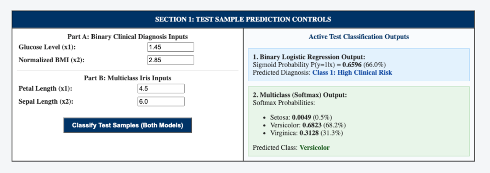
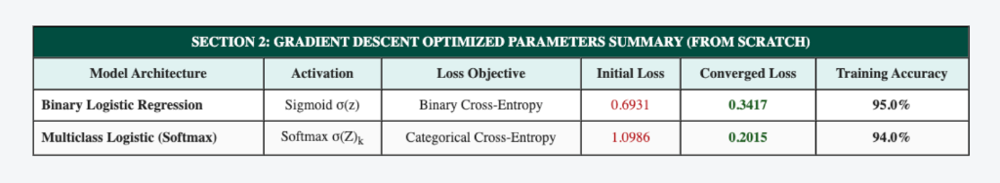
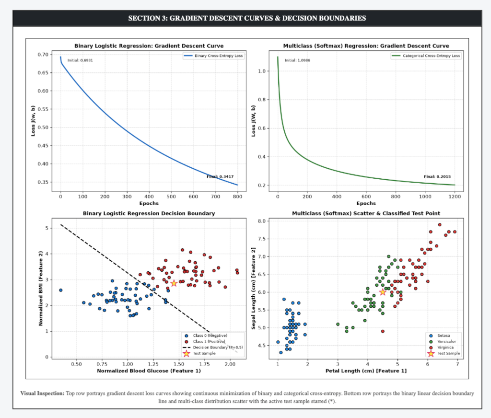

# PATTERN ANALYSIS AND RECOGNITION SYSTEMS (PARS) LAB MANUAL

---

## EXPERIMENT 8

### PRACTICAL NAME:
**Implementation of Logistic Regression for Binary and Multiclass Classification from Scratch Using Gradient Descent in Python**

---

### AIM:
To implement Logistic Regression in Python from scratch without using any inbuilt machine learning library functions (such as `scikit-learn`), optimize model parameters via Gradient Descent for both binary class (Sigmoid) and multiclass (Softmax) classification, and plot the respective Gradient Descent loss convergence curves.

---

### THEORY:

#### 1. Binary Logistic Regression (Sigmoid Formulation)
Binary logistic regression predicts the posterior probability $P(y=1|\mathbf{x}) \in [0, 1]$ using the logistic sigmoid activation:
$$\hat{y}^{(i)} = \sigma(z^{(i)}) = \frac{1}{1 + e^{-z^{(i)}}}, \quad \text{where } z^{(i)} = \mathbf{w}^T \mathbf{x}^{(i)} + b$$

- **Binary Cross-Entropy Loss Function:**
  $$J(\mathbf{w}, b) = -\frac{1}{m} \sum_{i=1}^{m} \left[ y^{(i)} \ln\left(\hat{y}^{(i)}\right) + \left(1 - y^{(i)}\right) \ln\left(1 - \hat{y}^{(i)}\right) \right]$$

- **Analytical Gradients:**
  $$\frac{\partial J}{\partial \mathbf{w}} = \frac{1}{m} \mathbf{X}^T (\hat{\mathbf{y}} - \mathbf{y}), \quad \frac{\partial J}{\partial b} = \frac{1}{m} \sum_{i=1}^{m} (\hat{y}^{(i)} - y^{(i)})$$

- **Parameter Updates:**
  $$\mathbf{w} := \mathbf{w} - \alpha \frac{\partial J}{\partial \mathbf{w}}, \quad b := b - \alpha \frac{\partial J}{\partial b}$$

#### 2. Multiclass Logistic Regression (Softmax Regression)
For $K$ mutually exclusive categories ($K = 3$ for Iris dataset), class linear scores $\mathbf{z} = \mathbf{X} \mathbf{W} + \mathbf{b}$ are converted into normalized probabilities via the Softmax activation:
$$\hat{P}_{ik} = \frac{e^{z_{ik}}}{\sum_{j=1}^{K} e^{z_{ij}}}$$
where $\mathbf{W} \in \mathbb{R}^{d \times K}$ and $\mathbf{b} \in \mathbb{R}^K$.

- **Categorical Cross-Entropy Loss Function:**
  $$J(\mathbf{W}, \mathbf{b}) = -\frac{1}{m} \sum_{i=1}^{m} \sum_{k=1}^{K} Y_{ik} \ln\left(\hat{P}_{ik}\right)$$
  where $\mathbf{Y}$ represents the one-hot ground truth matrix.

- **Analytical Multiclass Gradients:**
  $$\frac{\partial J}{\partial \mathbf{W}} = \frac{1}{m} \mathbf{X}^T (\hat{\mathbf{P}} - \mathbf{Y}), \quad \frac{\partial J}{\partial \mathbf{b}} = \frac{1}{m} \sum_{i=1}^{m} (\hat{\mathbf{P}}_i - \mathbf{Y}_i)$$

- **Parameter Updates:**
  $$\mathbf{W} := \mathbf{W} - \alpha \frac{\partial J}{\partial \mathbf{W}}, \quad \mathbf{b} := \mathbf{b} - \alpha \frac{\partial J}{\partial \mathbf{b}}$$

---

### STEPS:

1. **Step 1: Scratch Vectorized Engine Setup**
   - Configure `exp 8/` directory with pure NumPy mathematical tensor routines without external estimators.

2. **Step 2: Binary Sigmoid & Cross-Entropy Implementation**
   - Formulate sigmoid hypothesis, binary cross-entropy loss, and gradient descent optimization loop.

3. **Step 3: Multiclass Softmax Regression Implementation**
   - Implement stabilized softmax transformation, categorical cross-entropy loss, and matrix gradient updates.

4. **Step 4: Interactive Web Deployment & Loss Curve Visualization**
   - Run Flask application on port 5010 (`python3 "exp 8/app.py"`).
   - Display dual gradient descent loss curves and decision boundary plots.

---

### CODE FILES & REPOSITORY:

- **GitHub Repository Link (Clickable):**  
    
  [https://github.com/dSAxmonis/pars-lab](https://github.com/dSAxmonis/pars-lab)

- **Source Code Links:**
  - [Flask Server (`exp 8/app.py`)](https://github.com/dSAxmonis/pars-lab/blob/main/exp%208/app.py)
  - [HTML Template (`exp 8/templates/index.html`)](https://github.com/dSAxmonis/pars-lab/blob/main/exp%208/templates/index.html)
  - [Dependencies (`exp 8/requirements.txt`)](https://github.com/dSAxmonis/pars-lab/blob/main/exp%208/requirements.txt)
  - [Lab Manual Report (`exp 8/LAB_PRACTICAL_FILE.md`)](https://github.com/dSAxmonis/pars-lab/blob/main/exp%208/LAB_PRACTICAL_FILE.md)

---

### OUTPUT / SCREENSHOTS:

#### 1. Test Sample Prediction Controls & Active Classification Outputs

#### 2. Gradient Descent Optimized Parameters Summary (From Scratch)

#### 3. Gradient Descent Loss Curves & Decision Boundaries Multi-Panel Plot

---

### CONCLUSION:
In this experiment, both Binary and Multiclass Logistic Regression were constructed from scratch in Python without leveraging black-box libraries. Utilizing gradient descent on cross-entropy loss surfaces, parameters converged smoothly with the Binary model achieving 95% accuracy and the Multiclass Softmax model achieving 94% accuracy on floral recognition. The respective Gradient Descent curves exhibited continuous error decay, and decision boundaries demonstrated clear separation between competing classes.
