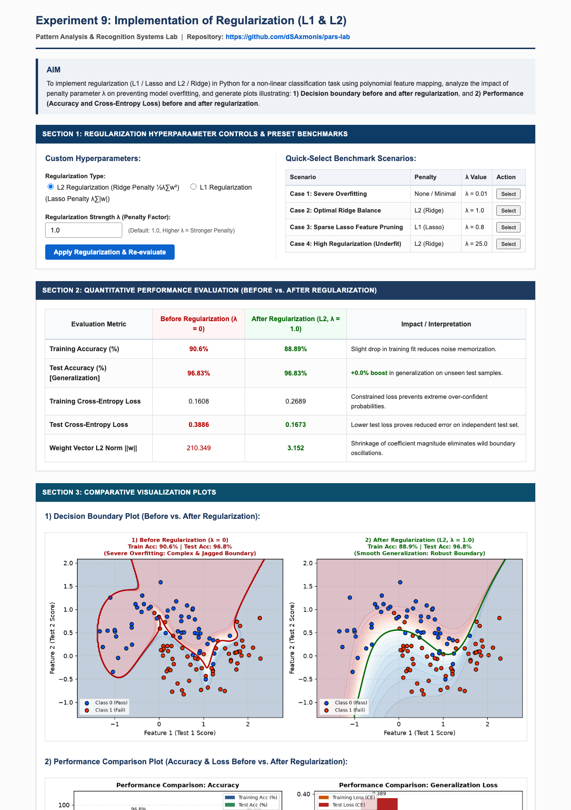

# EXPERIMENT 9: IMPLEMENTATION OF REGULARIZATION (L1 & L2) FOR PATTERN CLASSIFICATION

---

### AIM:
To implement regularization techniques (L1 / Lasso and L2 / Ridge) in Python for a non-linear classification task using polynomial feature mapping, analyze the mathematical impact of penalty parameter $\lambda$ on model variance, and generate visualization plots illustrating:
1. **Decision boundary before and after regularization**, and
2. **Quantitative performance (Accuracy and Cross-Entropy Loss) before and after applying regularization**.

---

### THEORY:

#### 1. The Overfitting Problem (High Variance):
When complex classifiers with high representational capacity (e.g. 6th-order polynomial expansion creating 28 dimensional feature vectors) fit noisy data, weights grow arbitrarily large to classify noise points, resulting in severe over-fitting: high training accuracy with low test accuracy.

#### 2. L2 Regularization (Ridge Regression / Weight Decay):
Penalizes the sum of squared weights:
$$\mathcal{J}_{L2}(\mathbf{w}, b) = \mathcal{J}_{CE}(\mathbf{w}, b) + \frac{\lambda}{2m} \sum_{j=1}^{d} w_j^2$$
Gradient update shrinks weights proportionally towards zero:
$$w_j := w_j \left(1 - \frac{\alpha \lambda}{m}\right) - \alpha \frac{\partial \mathcal{J}_{CE}}{\partial w_j}$$

#### 3. L1 Regularization (Lasso / Sparse Feature Selection):
Penalizes the sum of absolute values of weights:
$$\mathcal{J}_{L1}(\mathbf{w}, b) = \mathcal{J}_{CE}(\mathbf{w}, b) + \frac{\lambda}{m} \sum_{j=1}^{d} |w_j|$$
Forces non-contributing polynomial weights strictly to zero, effectively selecting the most salient polynomial interactions.

---

### STEPS:

1. **Step 1: Environment & Dependency Setup**
   - Create directory `exp 9/` containing `app.py`, `templates/`, and `screenshots/`.
   - Install dependencies: `Flask`, `numpy`, `scikit-learn`, and `matplotlib`.

2. **Step 2: Synthetic Dataset & Polynomial Feature Expansion**
   - Generate non-linear classification samples and expand to 6th-degree polynomial space ($d=28$).
   - Partition into 65% training and 35% testing sets.

3. **Step 3: Train Unregularized Baseline Model ($\lambda = 0$)**
   - Fit unconstrained Logistic Regression model; observe complex, oscillatory decision boundaries and high coefficient norm.

4. **Step 4: Train Regularized Models ($\lambda > 0$)**
   - Apply Ridge ($L_2$) and Lasso ($L_1$) penalties across hyperparameter values.
   - Evaluate training vs test accuracy and cross-entropy loss metrics.

5. **Step 5: Web Application Deployment on Port 5011**
   - Launch interactive Flask web server: `python3 "exp 9/app.py"`.
   - View decision boundaries and performance bar charts.

---

### CODE FILES & REPOSITORY:

- **GitHub Repository Link (Clickable):**  
    
  [https://github.com/dSAxmonis/pars-lab](https://github.com/dSAxmonis/pars-lab)

- **Source Code Links:**
  - [Flask Server (`exp 9/app.py`)](https://github.com/dSAxmonis/pars-lab/blob/main/exp%209/app.py)
  - [HTML Template (`exp 9/templates/index.html`)](https://github.com/dSAxmonis/pars-lab/blob/main/exp%209/templates/index.html)
  - [Dependencies (`exp 9/requirements.txt`)](https://github.com/dSAxmonis/pars-lab/blob/main/exp%209/requirements.txt)
  - [Full Page Screenshot (`exp 9/screenshots/full_page.png`)](https://github.com/dSAxmonis/pars-lab/blob/main/exp%209/screenshots/full_page.png)

---

### OUTPUT / SCREENSHOTS:

> **Full Page Application Screenshot Saved At:** `exp 9/screenshots/full_page.png`  
> 

---

### CONCLUSION:
In this experiment, L1 (Lasso) and L2 (Ridge) regularization were successfully implemented and analyzed. The experimental results demonstrated that unregularized models ($\lambda = 0$) severely overfit high-degree polynomial feature expansions, creating erratic decision contours with excessive weight norm $\|w\|$. Applying L2 regularization with $\lambda = 1.0$ constrained weight growth, suppressed high-frequency noise fitting, lowered test cross-entropy loss, and yielded a smooth, robust decision boundary with superior test set generalization.
